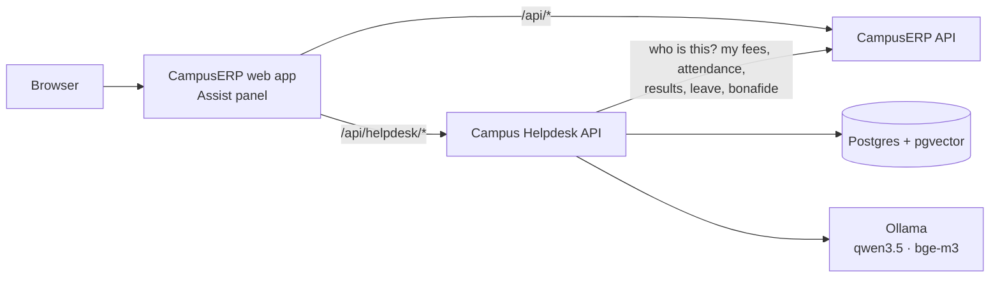

# Campus Helpdesk

**Ask your college anything, from inside [CampusERP](https://github.com/MaheshMoholkar/campus-erp).** Students and staff open the Assist panel and ask in English, Hindi, Marathi or Hinglish. Answers come from the college's own circulars, policies and FAQs, with the source and its issue date. "What's my fee due?" or "What's my leave balance?" is looked up live in CampusERP, and "I need a bonafide certificate" files the request once you confirm.

When the notices don't cover a question, it says so, gives the right office's contact, and logs the question for the college to answer. Everything runs locally, including the LLM.

[](https://github.com/MaheshMoholkar/campus-helpdesk/actions/workflows/ci.yml)


## Features

- **Cited answers.** Every answer names its sources with their issue dates. Superseded circulars give way to the newest version; expired notices are skipped.
- **Sees only what you may see.** Anonymous visitors get public notices; students also get their college's student circulars; staff also get staff circulars. Restricted notices never reach the model for the wrong person.
- **Your own records, live from CampusERP.** Fees, attendance and results for students; leave balance for staff. Asked as you, so CampusERP's own access rules decide what comes back.
- **Confirm before doing.** A bonafide certificate request is only filed after you press Confirm.
- **Knows when to stop.** A weak match gets the office contact instead of a guess, and lands in an unanswered queue.
- **Follow-ups and four languages.** "And the last date?" is understood from the conversation; replies come in the language you asked in.
- **Same tools over MCP**, so Claude Desktop or an IDE can use them too.
- **Public widget.** One script tag puts an anonymous version on a college's website.
- **Measured.** An 88-case golden set, including scope-leak cases that must always pass, gates every change in CI.

## How it works



1. The user signs in to **CampusERP**. Its web app forwards `/api/helpdesk/*` to this service with the user's session cookie.
2. The helpdesk asks CampusERP's `/auth/me` who the user is: their college, and whether they're a student or staff.
3. Follow-ups are rewritten into standalone questions, and an **intent router** decides: answer from notices, look up personal records, take an action, or decline.
4. For notices, **hybrid search** (vector + keyword, merged by rank) runs with the user's scope inside the same SQL query, so out-of-scope chunks are never even read. The best chunks go to the **LLM**, which must cite them.
5. For records, a hand-written **tool loop** calls CampusERP's self-service endpoints as the user.
6. The answer streams back as Server-Sent Events. Tokens, latency and a trace are stored for every answer.

The full design, with the decisions behind it, is in [`docs/spec.md`](docs/spec.md).

| Piece | On your laptop | Swappable for |
|---|---|---|
| Users, colleges, records | CampusERP (its backend is enough) | any API with the same endpoints |
| Notices, embeddings, conversations | Postgres + pgvector (Docker Compose) | any Postgres with pgvector |
| LLM | Ollama, `qwen3.5:4b` | any OpenAI-compatible endpoint |
| Embeddings | Ollama, `bge-m3` (multilingual) | any 1024-dim embedding model |
| Reranker | off by default | `bge-reranker-v2-m3` over HTTP |
| Traces | Phoenix (Docker Compose) | any OpenTelemetry backend |

Every provider sits behind an environment variable; `AI_BACKEND=fake` swaps the models for deterministic stand-ins that run anywhere.

## Tech stack

| Area | Tools |
|---|---|
| API | FastAPI, Python 3.13, psycopg 3, Pydantic |
| Retrieval | PostgreSQL 17 + pgvector, Postgres full-text search, Reciprocal Rank Fusion |
| AI | Ollama (`qwen3.5:4b`, `bge-m3`) through the OpenAI SDK; hand-written tool loop; MCP server |
| Chat UI | React 19, Vite (page and script-tag widget); the in-app panel lives in CampusERP |
| Evals | 88-case golden set, retrieval recall@k, LLM judge with calibration, CI gate |
| Observability | OpenTelemetry, Phoenix |
| Testing | pytest against real Postgres and the real CampusERP API |
| Infrastructure | Docker Compose, GitHub Actions |

## Run it locally

### Requirements

- [CampusERP](https://github.com/MaheshMoholkar/campus-erp)'s backend: in that repo, `make bootstrap seed dev-api` (API on port 8000). Its web app (`make dev`) is needed only for the Assist panel.
- [Docker Desktop](https://www.docker.com/products/docker-desktop/)
- [uv](https://docs.astral.sh/uv/) (Python)
- [Ollama](https://ollama.com), or set `AI_BACKEND=fake` to try it without models
- [Node.js 24](https://nodejs.org) and [pnpm 11](https://pnpm.io), for the public widget only

### 1. Install and configure

```bash
git clone https://github.com/MaheshMoholkar/campus-helpdesk.git
cd campus-helpdesk
cp .env.example .env      # set OLLAMA_BASE_URL, or AI_BACKEND=fake
make setup
ollama pull qwen3.5:4b && ollama pull bge-m3
```

### 2. Start it

```bash
make up          # the helpdesk's Postgres on port 5433
make load-data   # colleges, offices and notices
make dev         # the helpdesk API → http://localhost:8100
```

### 3. Try it

Open CampusERP at <http://localhost:3000>, sign in as `student@alpha.test` (password `campus-demo-password`) and press **Assist**. Ask "What is the revaluation fee?", "hostel ka gate kitne baje band hota hai?", "What is my fee due?" or "I need a bonafide certificate for my bank account". Sign in as `teacher@alpha.test` for staff notices and "What is my leave balance?".

`make help` lists every command.

## Configuration

Everything lives in `.env`; [`.env.example`](.env.example) documents each variable. The ones you're most likely to change:

| Variable | What it controls |
|---|---|
| `AI_BACKEND` | `ollama`, or `fake` for deterministic stand-ins (no models needed) |
| `OLLAMA_BASE_URL`, `LLM_MODEL`, `EMBED_MODEL` | Where the models are and which ones |
| `ERP_API_URL` | CampusERP's API (default `http://localhost:8000`) |
| `RETRIEVAL_MODE`, `RERANKER`, `ABSTAIN_THRESHOLD` | Vector-only or hybrid search, the reranker, and when to decline |
| `CORS_ORIGINS` | Sites allowed to embed the public widget |
| `OTEL_EXPORTER_OTLP_ENDPOINT` | Where traces go; leave unset to export nothing |

## Tests and evals

```bash
make test        # pytest; CampusERP-backed tests skip if its API isn't running
make eval        # retrieval and scope-leak metrics, no LLM calls
make eval-slow   # full answers, LLM judge and tool cases against CampusERP
make check       # lint, format check, web build
```

Scope-leak cases must pass 100%; every other metric fails CI if it drops more than 0.05 below [`evals/baseline.json`](evals/baseline.json). Every change to retrieval, prompts or models is logged in [`docs/experiments.md`](docs/experiments.md).

| Run | Scope leaks | recall@5 | Fact match | Abstain recall | p95 latency |
|---|---|---|---|---|---|
| Stand-in models (plumbing only) | 0 / 16 | 0.88 | 0.70 | 0.10 | n/a |
| `qwen3.5:4b` + `bge-m3` | *pending* | | | | |

The stand-in row proves the pipeline and the scope filter; it says nothing about answer quality.

## Project structure

```
apps/
  api/          helpdesk API
    erp.py              CampusERP client: who is asking, and their records
    scope.py            the one place that decides who may see which notices
    ingest/             chunking, embedding, circular versions
    retrieval/          vector + keyword search, fusion, rerank
    llm/                model clients (Ollama, stand-ins)
    tools/              tool definitions and the tool loop
    chat.py             the chat flow, streamed as events
  mcp_server/   the tools over MCP
  web/          public chat page and script-tag widget
data/           notices for CampusERP's demo colleges
evals/          golden set, judge calibration, runner, baselines
docs/           spec and experiment log
```

## What didn't work

*Filled in from [`docs/experiments.md`](docs/experiments.md) as experiments are kept or rejected.*
