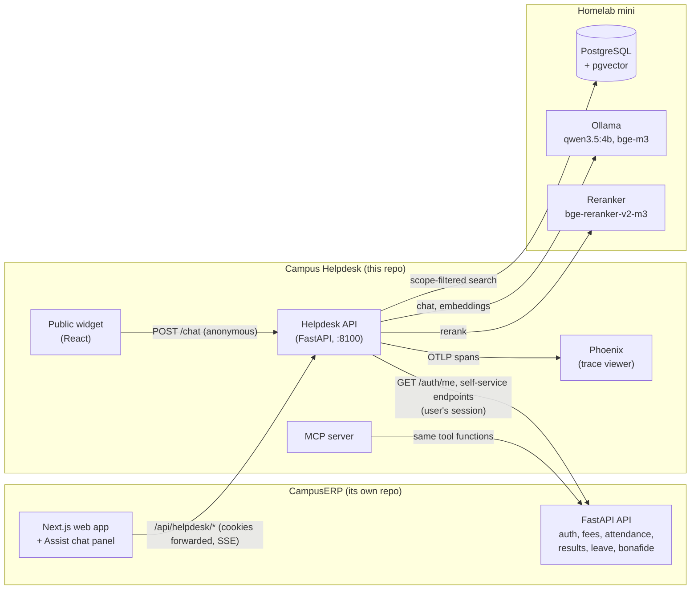
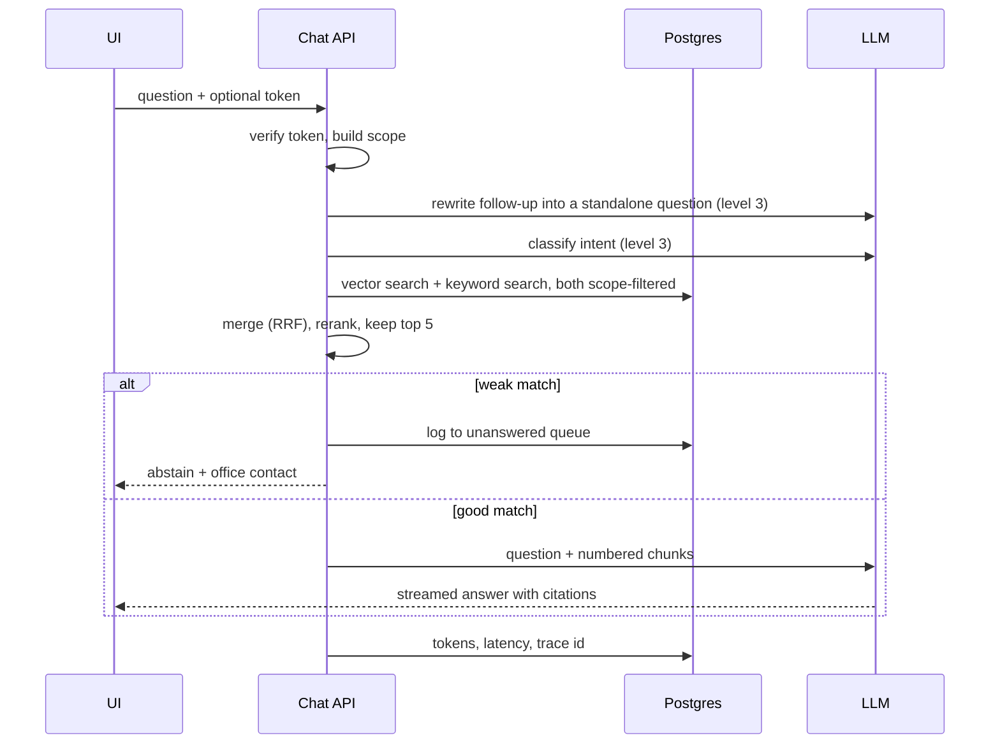
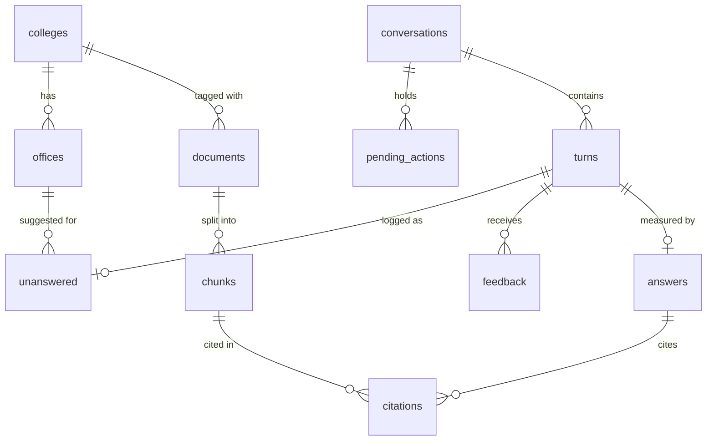

# Campus Helpdesk — Specification

Status: reworked 2026-10-01 as an extension of CampusERP. Code built and tested with stand-in models against CampusERP's real API (demo data); the real-model path (Ollama on the mini) is not yet verified.

## 1. What it is

An AI helpdesk that extends [CampusERP](https://github.com/MaheshMoholkar/campus-erp), my multi-college ERP (Next.js and FastAPI). It answers college questions from circulars, policies, placement notices and FAQs with citations, and looks up a logged-in user's own CampusERP records (fees, attendance, results, leave) through CampusERP's API. It is a separate service in its own repository, built in levels, each one demoable and measured; it is also my project for learning applied AI.

## 2. Who uses it

Users are CampusERP users. Colleges are CampusERP institutes (in development, the two `make seed` creates: `alpha` = Sahyadri Engineering College, `beta` = Deccan Science College). The helpdesk has no logins of its own: CampusERP's `/auth/me` says who someone is.

| Role | How CampusERP identifies them | Can ask about | Documents visible |
|------|-------------------------------|---------------|-------------------|
| Anonymous | No CampusERP session (public widget on a college website) | General, admissions and placement questions | `public`, from every college |
| Student | Login linked to a student | The above, plus their college's circulars and their own records | All `public`; `student` for their college and for `all` |
| Staff | Any other college login (teachers, office staff, administrators) | The above, plus staff circulars; leave balance if linked to a staff member | All `public`; `student` and `staff` for their college and for `all` |

`public` documents are visible to everyone whatever college they belong to, so logging in never narrows what a user sees.

## 3. Knowledge

- Document types: circulars, policies (exam, fee, hostel), placement notices, FAQs.
- Every document is tagged with college (a CampusERP institute code, or `all` for both), audience, category, issue date and expiry.
- Circulars can be college-specific and get superseded: the newest wins, expired ones are skipped, and the issue date is shown in every citation.
- Documents are written for CampusERP's demo colleges; their content is invented and describes no real institution. Personal records are never copied into the helpdesk: they are read live from CampusERP.

## 4. Capabilities

### v1 — levels 1 to 4

1. **Grounded answers.** Ingest → hybrid search (vector + keyword) → rerank → answer with citations. The scope filter is applied *before* search so restricted documents can never reach the model. On a weak match the assistant abstains, gives the relevant office contact, and logs the question to an "unanswered" queue.
2. **Evals and observability.** Golden set including scope-leak and refusal cases; retrieval recall@k; answer faithfulness via LLM-as-judge; CI gate; tracing; cost and latency per answer.
3. **Conversation.** Rewrite follow-up questions using history; intent router (FAQ / personal / action / out of scope); English first, then Hindi, Marathi and Hinglish, answering in the user's language.
4. **Tools.** "My fees", "my attendance" and "my results" for students and "my leave balance" for staff, read from CampusERP's self-service endpoints as the user; one confirm-before-doing action (request a bonafide certificate, a new CampusERP endpoint); the same tools exposed as an MCP server.

Each level ships as its own demoable, measured milestone.

### Roadmap — levels 5 to 7

5. Scanned circulars, tables, photo upload.
6. Prompt-injection test set, PII redaction in logs, rate limits, prompt caching, small/large model routing.
7. Real WhatsApp channel; admin console (unanswered queue, feedback turned into new eval cases, content-gap report), ideally as CampusERP pages.

## 5. Interfaces

The helpdesk API (port 8100 in development):

- `POST /ingest` — document + tags (header `X-API-Key`).
- `POST /chat` — question, optional `conversation_id` and optional `pending_action_id` (to confirm an action) → streamed answer with citations (Server-Sent Events). Identity comes from the CampusERP session cookie, if present.
- `POST /feedback` — thumbs up/down.
- `GET /health`.

### How it plugs into CampusERP

- **Inside CampusERP:** CampusERP's web app forwards `/api/helpdesk/*` to the helpdesk with the browser's cookies, and shows an "Assist" chat panel to logged-in users. The browser only ever talks to CampusERP's own origin.
- **Identity:** the helpdesk calls CampusERP's `GET /api/v1/auth/me` with the user's `__Host-session` cookie. CampusERP's response gives the user, the institute code and whether the login is linked to a student or a staff member.
- **CSRF:** a `POST /chat` that carries a CampusERP session must also carry `X-CSRF-Token` equal to the `__Host-csrf` cookie (CampusERP's double-submit rule), checked by the helpdesk.
- **Tools:** the helpdesk calls CampusERP's self-service endpoints (`fees/my-account`, `teaching/my-attendance`, `exams/my-results`, `hr/my-leave`, `people/my-bonafide-requests`) with the same session, so CampusERP's own access rules decide what comes back.
- **Public widget:** the same React chat component, built as a script-tag widget for a college's public website. It is anonymous; the only backend concern it adds is a CORS allowlist.
- **No shared database.** The helpdesk keeps its own Postgres (documents, chunks, conversations, metrics) and never reads CampusERP's tables.

### UI

- Logged-in users: the Assist panel inside CampusERP's web app (built in the CampusERP repo).
- Public: the React chat component in this repo, as a page and as an embeddable widget.

## 6. Quality bar

- Every change to prompts or retrieval runs the golden set in CI.
- Scope-leak cases must pass 100%; other thresholds are set after the first baseline run.
- The README carries the eval table, cost per answer, p95 latency and a "what didn't work" section.

## 7. Boundaries

- Extends CampusERP only through its HTTP API: no shared database, no imports from its code. CampusERP changes needed by the helpdesk (the bonafide endpoint, the `/auth/me` additions, the forwarding and the chat panel) are made in the CampusERP repo following its conventions.
- No link to the Campus Support project.
- No real institution data of any kind.
- Retrieval and the tool loop are written by hand first; a framework is brought in only if it is later justified.

## 8. Stack

- Python, FastAPI, PostgreSQL + pgvector, React for the chat UI, GitHub Actions.
- AI stack: `qwen3.5:4b` (LLM) and BGE-M3 (embeddings) on Ollama, `bge-reranker-v2-m3` (reranker), OpenTelemetry with Phoenix (tracing). Details and trade-offs in section 10.6.
- A homelab (Postgres, Redis, S3, Ollama for local models, reachable via the `lab` CLI) provides Postgres and the models for development and CI.

## 9. Decisions log

| Date | Decision | Notes |
|------|----------|-------|
| 2026-10-01 | v1 = levels 1 to 4 | Confirmed as proposed. |
| 2026-10-01 | Languages: English first, then Hindi, Marathi and Hinglish, within v1 | Confirmed as proposed. Implies multilingual embedding and reranking models and golden-set cases per language. |
| 2026-10-01 | UI: React chat component plus embeddable script-tag widget in v1 | Changed from "web only". Host page remains undecided. |
| 2026-10-01 | Spec lives at `docs/spec.md`, Markdown with Mermaid diagrams | |
| 2026-10-01 | LLM: `qwen3.5:4b` on the homelab Ollama | Gemini (via an AI Studio key) was considered and dropped. 8k context, speed and Indic-language quality are accepted risks, measured by evals. |
| 2026-10-01 | Embeddings: BGE-M3 on Ollama | Multilingual, 1024-dim. Fixes the vector column size. |
| 2026-10-01 | Reranker: `bge-reranker-v2-m3` on the mini | Added after a no-reranker baseline. Serving method open. |
| 2026-10-01 | Tracing: OpenTelemetry SDK with Phoenix | |
| 2026-10-01 | Models run on the mini; CI uses a self-hosted runner there | Development and CI depend on the tailnet. |
| 2026-10-01 | `public` documents are visible across all colleges | College restricts only `student` and `staff` documents. |
| 2026-10-01 | Interface addition: optional `pending_action_id` on `/chat` | |
| 2026-10-01 | Supersession is modelled as series + version | One current version per series, enforced by the database. |
| 2026-10-01 | Faithfulness judge: `qwen3.5:4b` (same model as the generator) | Known weakness. Claim-level judging, calibration against hand labels, gated only above 85% agreement. |
| 2026-10-01 | Corpus: about 130 English documents plus about 20 Hindi/Marathi circulars | |
| 2026-10-01 | First golden set: about 80 cases, split 60 development / 20 held out | |
| 2026-10-01 | Data set: facts plan first, document text written in a Claude Code session, committed as static files | Golden-set facts come from the plan. |
| 2026-10-01 | Build order M0 to M7 | Evals (M2) come before retrieval improvements (M3). |
| 2026-10-01 | Stand-in models (`AI_BACKEND=fake`) for tests, CI fast tier and offline work | Word-matching toys: they prove plumbing and scope, not answer quality. |
| 2026-10-01 | CI fast tier on GitHub runners with stand-in models; slow tier on the mini | Changed from "all CI on the mini" (section 10.8). |
| 2026-10-01 | First corpus: 33 documents (incl. 4 Hindi/Marathi) instead of about 150 | Grows once a real-model baseline exists. Golden set: 88 cases (78 + 2 follow-up + 8 tool). |
| 2026-10-01 | Reranker called over HTTP in the Hugging Face text-embeddings-inference format (`RERANKER=http`) | Works with a TEI container on the mini; Ollama rerank support still unconfirmed. |
| 2026-10-01 | MCP confirm-before-doing uses a `confirm` argument | MCP has no pending-action id; the tool returns `needs_confirmation` first. |
| 2026-10-01 | **Campus Helpdesk is an extension of CampusERP**, not a standalone app | Replaces "fully standalone, invented university". Users, colleges and records come from CampusERP; the mock student API and its JWT logins are removed. |
| 2026-10-01 | Separate repo and service; CampusERP's web app forwards `/api/helpdesk/*` and hosts the chat panel | Keeps LLM and pgvector dependencies out of CampusERP and its module boundaries intact. |
| 2026-10-01 | Bonafide requests become a CampusERP endpoint | `POST/GET /api/v1/people/my-bonafide-requests`, plus an office list; built in the CampusERP repo. |
| 2026-10-01 | "My results" replaces "my timetable" | CampusERP has no timetable endpoint; results, fees, attendance and leave already exist. |
| 2026-10-01 | `/auth/me` gains `institute.code` and `person` (student/staff link) | Additive change in CampusERP, needed to map users onto scope and tools. |
| 2026-10-01 | Tests and evals call CampusERP's real API (`make dev-api`, demo data) | No duplicate fake of CampusERP. Tests that need it skip when it is not running (e.g. on GitHub's runners). |

## 10. Architecture

### 10.1 Components



| Component | Responsibility |
|-----------|----------------|
| Helpdesk API | `/ingest`, `/chat`, `/feedback`, `/health`. Owns scope enforcement, retrieval, the answer prompt and the tool loop. Identifies users through CampusERP. |
| CampusERP | Source of users, colleges and personal records. Its web app forwards `/api/helpdesk/*` and hosts the Assist panel; its API answers `/auth/me` and the self-service endpoints the tools call. |
| MCP server | Exposes the level 4 tools over the Model Context Protocol by wrapping the same Python functions the helpdesk API uses. |
| Public widget | The React chat component as a page and as a script-tag bundle, for a college's public website. Anonymous. |
| PostgreSQL + pgvector | The helpdesk's own database: documents, chunks with embeddings, conversations, the unanswered queue, feedback and per-answer metrics. Separate from CampusERP's database. |
| Ollama | Serves the chat model and the embedding model over an OpenAI-compatible HTTP API. |
| Phoenix | Receives OpenTelemetry spans and shows each answer's prompt, retrieved chunks and timings. |

### 10.2 `/chat` request flow



1. **Token.** No token means anonymous. A token is verified (section 10.5) and yields role, college and student id.
2. **Scope.** The claims become a scope object (section 10.4). Every later step receives it.
3. **Rewrite (level 3).** A follow-up such as "and for hostel?" is rewritten into a standalone question using the last few turns, because search works on one self-contained query.
4. **Route (level 3).** FAQ goes to retrieval; personal and action go to tools (section 10.7); out of scope gets a short refusal.
5. **Retrieve.** Two scope-filtered queries run against the chunks table: vector similarity (top 30) and Postgres full-text search (top 30). The lists are merged with Reciprocal Rank Fusion, which combines by rank position and so needs no score tuning. The reranker then scores the merged candidates against the question and the top 5 are kept.
6. **Abstain check.** If the best candidate scores below a threshold, the assistant does not answer: it returns the relevant office contact and stores the question in the unanswered queue. The threshold is set from the first baseline run.
7. **Answer.** The model receives the question and the numbered chunks and must cite them. The answer streams to the client as Server-Sent Events; each citation carries the document title and issue date.
8. **Record.** Token counts, latency per stage and the trace id are stored per answer.

Why hybrid search: vector search matches meaning and works across languages (a Hindi question against an English circular), while keyword search catches exact tokens that embeddings blur, such as course codes, dates and circular numbers. Postgres full-text search stems English well, has limited support for Hindi and none for Marathi or Hinglish (the configurations actually available are checked when the database is set up). Keyword search therefore mainly helps English and exact-token queries; cross-language recall rests on the embedding model.

Why no vector index at first: with about 150 documents (on the order of a thousand chunks) Postgres can compare against every row exactly in milliseconds. An approximate index (HNSW) combined with a filter can silently drop valid rows, so it is added later only as a measured experiment.

### 10.3 Ingest flow

1. Validate the tags: college, audience, category, issue date, expiry.
2. Split the document into chunks of roughly 300 to 400 tokens with a small overlap, keeping headings with their text.
3. Embed each chunk with BGE-M3 (1024 dimensions).
4. Store the document and its chunks in one transaction. The scope and validity tags are copied onto every chunk row.
5. If the document belongs to a series, it becomes the current version and the previous version is marked as not current, in the same transaction (section 11.2).

Ingest is idempotent: re-posting the same document replaces its chunks rather than duplicating them.

### 10.4 Scope enforcement

The rule, stated once:

> A chunk is visible if its audience is `public`, **or** its audience is one the user's role may see **and** its college is the user's college or `all`.

| Role | Restricted audiences allowed | Colleges for restricted documents |
|------|------------------------------|-----------------------------------|
| Anonymous | none | — |
| Student | `student` | own college, `all` |
| Staff | `student`, `staff` | own college, `all` |

Validity is part of the same filter: expired chunks and chunks from a version that is no longer current are excluded.

How it is made hard to get wrong:

- One function builds the scope from the token claims. Nothing else constructs a filter.
- Both search functions take the scope as a required argument and apply it inside the SQL `WHERE` clause, in the same statement as the search. There is no "search first, filter after" path, so a restricted chunk is never loaded into application memory, let alone the prompt.
- Scope tags live on the chunk rows themselves, so the filter cannot be lost by a forgotten join.
- The golden set contains scope-leak cases that must pass 100% (section 6).

### 10.5 Authentication

- The helpdesk has no logins. The user signs in to CampusERP, which sets its `__Host-session` (HttpOnly) and `__Host-csrf` cookies.
- The Assist panel calls `/api/helpdesk/chat` on CampusERP's own origin; CampusERP's web app forwards the request, cookies included, to the helpdesk.
- The helpdesk picks out only CampusERP's two cookies and calls CampusERP's `GET /api/v1/auth/me` with the session. The answer becomes the user's claims: `sub` = `<institute code>:<user id>`, role (student if the login is linked to a student, otherwise staff), college (institute code), and whether the login is linked to a student or staff member. It is fetched on every chat request, not cached: CampusERP may rotate a session on its next request (after a role or grant change), so the helpdesk lets that happen on `/auth/me`, uses the new token for the rest of the turn, and passes CampusERP's `Set-Cookie` back on the `/chat` response so the browser keeps its session.
- No session cookie means anonymous. A session CampusERP rejects is a `401`, never anonymous. CampusERP unreachable is a `503`.
- Every `POST` that carries a session must pass CampusERP's double-submit rule: `X-CSRF-Token` equal to the `__Host-csrf` cookie. Otherwise another site could make a logged-in browser chat, or confirm an action, on the user's behalf.
- Tools call CampusERP with the same session (and, for `POST`, the CSRF cookie and header), so CampusERP's own access rules apply to every lookup.

### 10.6 AI stack

| Slot | Choice | Where it runs |
|------|--------|---------------|
| LLM | `qwen3.5:4b` | Ollama on the mini |
| Embeddings | BGE-M3, 1024-dim, multilingual | Ollama on the mini (`bge-m3`, 1.2 GB, needs pulling) |
| Reranker | `bge-reranker-v2-m3`, multilingual | On the mini; serving method open (see below) |
| Tracing | OpenTelemetry SDK → Phoenix | Phoenix container next to the app |

Each slot sits behind a small interface (`LLMClient`, `Embedder`, `Reranker`) selected by configuration. The Ollama base URL is a setting, so any machine with Ollama and the same models can stand in for the mini.

Consequences of a small local LLM, accepted for v1 and measured by the evals:

- **8k context window.** The prompt has a fixed budget:

  | Part | Tokens (approx.) |
  |------|------------------|
  | System prompt and rules | 500 |
  | Tool definitions (level 4) | 600 |
  | Recent turns | 800 |
  | Retrieved chunks, 5 × 400 | 2,000 |
  | Question | 100 |
  | Answer | 800 |
  | **Total** | **4,800**, leaving about 3,000 spare |

  Devanagari text uses more tokens per word than English, which is what the spare room is for.
- **Speed.** About 30 tokens per second, so a 300-token answer takes roughly 10 seconds. Streaming is essential. The model's thinking mode is switched off (`reasoning_effort="none"`), because it is slow.
- **Language quality.** Hindi, Marathi and Hinglish answers from a 4B model are a known risk. The per-language golden-set results decide whether this slot needs a stronger model.
- **Judging.** Using the same small model as the faithfulness judge is weak evidence. This is decided in the eval plan (section 12).
- **Cost per answer.** There is no API bill, so the README reports tokens and latency per answer.
- **Memory.** The chat and embedding models must stay loaded together on the mini; otherwise Ollama swaps them on every request. Rough footprint on the 16 GB mini: chat model about 4.3 GB, BGE-M3 about 1.2 GB, reranker 1 to 2 GB, plus Postgres, so 7 to 8 GB in total. `lab.yml` lists only Postgres, and other lab services should be stopped during eval runs.

Open item: Ollama's support for rerank models is not confirmed. The reranker is added only after the no-reranker baseline is measured, and at that point it is served either by Ollama or by a small rerank container on the mini.

### 10.7 Tool loop and MCP

Tools, each a call to a CampusERP self-service endpoint as the user:

| Tool | Offered to | CampusERP endpoint |
|------|-----------|--------------------|
| `get_my_fees` | students | `GET /api/v1/fees/my-account` |
| `get_my_attendance` | students | `GET /api/v1/teaching/my-attendance` |
| `get_my_results` | students | `GET /api/v1/exams/my-results` |
| `request_bonafide` (action) | students | `POST /api/v1/people/my-bonafide-requests` |
| `get_my_leave` | logins linked to a staff member | `GET /api/v1/hr/my-leave` |

- **Loop.** The model is given the tools its user may use. When it asks for one, the helpdesk calls CampusERP, returns a trimmed result to the model, and repeats until the model answers in text, with a cap of three rounds.
- **Identity never comes from the model.** Tools take no id argument. CampusERP decides whose records to return from the session, so the model cannot be talked into fetching someone else's data.
- **Anonymous users** get "please log in to CampusERP"; logins linked to neither a student nor a staff member are told there are no personal records to look up.
- **Confirm before doing.** `request_bonafide` does not execute when the model calls it. The helpdesk stores a pending action and the answer asks the user to confirm. Only a follow-up `/chat` call that carries the pending action id and comes from the same user executes it.
- **MCP.** The MCP server is a thin wrapper that registers the same five functions, so there is one implementation with two front doors. It runs as its own process with the user's CampusERP session in its environment.

### 10.8 Running it and CI

- **Development.** `lab up` provisions the helpdesk's Postgres database with pgvector on the mini and writes `.env.lab` (or `docker compose up -d postgres` locally). CampusERP runs from its own repo (`make dev`: API on :8000, web on :3000); the helpdesk API runs on :8100. Only CampusERP's backend is needed (`make up db-bootstrap migrate seed dev-api`); its web app only for the Assist panel. Phoenix runs from `docker-compose`.
- **Configuration.** The apps read environment variables only. `.env.lab` is never committed.
- **CI.** The fast tier (unit tests, scope-leak checks, retrieval metrics) runs on GitHub's own runners with the deterministic stand-in models (`AI_BACKEND=fake`); tests that need CampusERP skip there. So the 100% scope-leak gate never depends on the mini. The slow tier runs on a self-hosted runner on the mini, because GitHub's runners cannot reach Ollama. Each run starts a throwaway pgvector container, ingests the document set and runs the golden set.
- **Self-hosted runner safety.** A self-hosted runner executes whatever a workflow tells it to, on the mini itself. If the repository is public, workflows must not run automatically for pull requests from forks; the repository setting that requires approval for outside contributors must be on before the runner is attached.
- **Eval run time.** At about 30 tokens per second a full golden-set run with generation takes many minutes. The eval plan therefore separates fast retrieval-only checks from slower answer checks.
- **Dependency on the mini.** Development and CI need the tailnet and the mini to be up. This was chosen knowingly over a self-contained setup; the configurable Ollama URL is the escape hatch.

### 10.9 Repository layout

```
campus-helpdesk/
├── apps/
│   ├── api/              # helpdesk API
│   │   ├── erp.py        # CampusERP client: identity (/auth/me) and self-service calls
│   │   ├── scope.py      # the one scope builder
│   │   ├── ingest/       # chunking, embedding, supersession
│   │   ├── retrieval/    # vector, keyword, fusion, rerank
│   │   ├── llm/          # LLMClient, Embedder, Reranker
│   │   ├── tools/        # tool definitions and the loop
│   │   └── telemetry.py  # OpenTelemetry setup
│   ├── mcp_server/       # MCP wrapper around the tools
│   └── web/              # public React chat page and widget build
├── data/                 # documents for CampusERP's demo colleges
├── evals/                # golden set and runners
├── docs/
├── docker-compose.yml    # Phoenix, local Postgres option
├── lab.yml               # homelab services for this project
└── .github/workflows/
```

The Assist panel, the `/api/helpdesk/*` forwarding, the bonafide endpoint and the `/auth/me` additions live in the CampusERP repo.

## 11. Data model

The helpdesk's tables live in its own Postgres database (schema `helpdesk`). Personal records are not stored here; they stay in CampusERP and are read live through its API. `user_sub` columns hold `<institute code>:<CampusERP user id>`.

### 11.1 ER diagram (chat API)



### 11.2 `documents`

| Column | Type | Notes |
|--------|------|-------|
| `id` | uuid, PK | |
| `slug` | text, unique | Stable readable id, e.g. `coe-fee-structure-2026-v2`. Used by the generated data set and by golden-set cases, which cannot refer to random uuids. |
| `title` | text | Shown in citations. |
| `doc_type` | text | `circular`, `policy`, `placement_notice`, `faq`. |
| `college_code` | text, FK → `colleges` | A college code, or `all`. |
| `audience` | text | `public`, `student`, `staff`. |
| `category` | text | `exam`, `fee`, `hostel`, `admission`, `placement`, `general`. |
| `language` | text | `en`, `hi`, `mr`. |
| `issue_date` | date | Shown in every citation. |
| `expires_on` | date, nullable | Null means no expiry. |
| `series_key` | text, nullable | Groups versions of the same circular, e.g. `fee-structure-coe`. Null for one-off documents. |
| `version` | int | Starts at 1; unique per series. |
| `is_current` | boolean | True for the highest version in a series, and for every one-off document. |
| `reference_no` | text, nullable | Circular number as printed. |
| `content_hash` | text | Makes ingest idempotent. |
| `body` | text | Original text. |
| `created_at` | timestamptz | |

Supersession rules:

- A new document with an existing `series_key` gets the next `version` and becomes current; ingest clears `is_current` on the previous version in the same transaction.
- A partial unique index on `series_key` where `is_current` is true makes two live versions of one series impossible: the database rejects it, whatever the application does.
- "Newest wins" is strict. If the current version has expired, older versions do not come back; the series simply has no valid document and the assistant abstains.

### 11.3 `chunks`

| Column | Type | Notes |
|--------|------|-------|
| `id` | uuid, PK | |
| `document_id` | uuid, FK → `documents` | Chunks are deleted with their document. |
| `chunk_index` | int | Order within the document. |
| `heading` | text, nullable | Nearest heading, kept for context. |
| `text` | text | What the model sees. |
| `embedding` | `vector(1024)` | BGE-M3. |
| `tsv` | `tsvector` | For keyword search; built at ingest with the English configuration for English text and the `simple` configuration otherwise. |
| `college_code`, `audience`, `category`, `language`, `issue_date`, `expires_on`, `is_current` | as on `documents` | Copied from the parent document at ingest. |

- The copied columns are what section 10.4 filters on. Search and filter happen in one statement against one table.
- The copies cannot drift: a document's tags are never updated in place. A correction is a re-ingest, which replaces the document's chunks in one transaction. The only column that changes later is `is_current`, and ingest updates it on the document and its chunks together.
- Indexes: GIN on `tsv`; B-tree on (`audience`, `college_code`). No vector index initially (section 10.2).
- Changing the embedding model means a different vector size and a full re-embed, so the model name is recorded in configuration and checked at startup.

### 11.4 Conversation

`conversations`

| Column | Type | Notes |
|--------|------|-------|
| `id` | uuid, PK | |
| `user_sub` | text, nullable | Token subject; null for anonymous. |
| `role` | text | `anonymous`, `student`, `staff`. |
| `college_code` | text, nullable | |
| `created_at` | timestamptz | |

`turns`

| Column | Type | Notes |
|--------|------|-------|
| `id` | uuid, PK | |
| `conversation_id` | uuid, FK | |
| `seq` | int | Order within the conversation. |
| `speaker` | text | `user` or `assistant`. |
| `text` | text | |
| `language` | text, nullable | Detected language of a user turn. |
| `rewritten_question` | text, nullable | Standalone form used for search (level 3). |
| `intent` | text, nullable | `faq`, `personal`, `action`, `out_of_scope`. |
| `created_at` | timestamptz | |

The role and college are stored on the conversation for reporting only. Scope is always rebuilt from the token on each request, never read back from these rows.

### 11.5 Operational tables

`answers` — one row per assistant turn.

| Column | Type | Notes |
|--------|------|-------|
| `turn_id` | uuid, PK, FK → `turns` | |
| `outcome` | text | `answered`, `abstained`, `refused`, `tool`. |
| `model` | text | |
| `prompt_version` | text | Ties an answer to the prompt that produced it. |
| `prompt_tokens`, `completion_tokens` | int | |
| `retrieval_ms`, `rerank_ms`, `first_token_ms`, `total_ms` | int | Latency per stage. |
| `top_score` | real, nullable | Best candidate score, compared against the abstain threshold. |
| `trace_id` | text | Links to the trace in Phoenix. |

`citations` — which chunks an answer cited.

| Column | Type | Notes |
|--------|------|-------|
| `turn_id` | uuid, FK → `answers` | |
| `position` | int | The `[n]` number in the answer. |
| `document_id` | uuid | Kept even if the chunk is later replaced. |
| `chunk_id` | uuid, nullable | Set to null if the chunk is deleted by a re-ingest. |
| `score` | real | |

`feedback`

| Column | Type | Notes |
|--------|------|-------|
| `id` | uuid, PK | |
| `turn_id` | uuid, FK → `turns` | The assistant turn being rated. |
| `rating` | smallint | `1` or `-1`. |
| `comment` | text, nullable | |
| `created_at` | timestamptz | |

`unanswered` — the queue fed by abstentions.

| Column | Type | Notes |
|--------|------|-------|
| `id` | uuid, PK | |
| `turn_id` | uuid, FK → `turns` | The user turn that could not be answered. |
| `question` | text | Standalone form. |
| `language`, `role`, `college_code` | text | Who asked, for the content-gap report (level 7). |
| `top_score` | real, nullable | |
| `office_id` | uuid, FK → `offices` | The contact given to the user. |
| `status` | text | `open` or `resolved`. |
| `created_at` | timestamptz | |

`pending_actions` — actions waiting for the user's confirmation.

| Column | Type | Notes |
|--------|------|-------|
| `id` | uuid, PK | Sent back to the client as `pending_action_id`. |
| `conversation_id` | uuid, FK | |
| `user_sub` | text | Must match the token on the confirming request. |
| `tool_name` | text | `request_bonafide` in v1. |
| `arguments` | jsonb | What the model asked for. |
| `status` | text | `pending`, `executed`, `cancelled`, `expired`. |
| `expires_at` | timestamptz | Short lifetime, e.g. ten minutes. |
| `created_at`, `executed_at` | timestamptz | |

Conversation text and user ids are stored in plain form in v1, which is acceptable because all data is invented. Redaction of personal data in logs is level 6.

### 11.6 CampusERP data used (not stored)

| Data | Where it comes from |
|------|---------------------|
| Who the user is, their college, student/staff link | `GET /api/v1/auth/me` |
| Fees, attendance, results | `fees/my-account`, `teaching/my-attendance`, `exams/my-results` |
| Leave balances | `hr/my-leave` |
| Bonafide requests | `people/my-bonafide-requests` (new in CampusERP) |

College codes in `documents.college_code` and `offices.college_code` must match CampusERP institute codes.

### 11.7 Reference data

`colleges`

| Column | Type | Notes |
|--------|------|-------|
| `code` | text, PK | CampusERP institute code (e.g. `alpha`); includes the special row `all`. |
| `name` | text | |

`offices`

| Column | Type | Notes |
|--------|------|-------|
| `id` | uuid, PK | |
| `name` | text | e.g. "Examination Cell". |
| `college_code` | text, FK → `colleges` | `all` for university-wide offices. |
| `category` | text | Matches `documents.category`. |
| `email`, `phone`, `hours` | text | |

When the assistant abstains, it picks the office by the question's category and the user's college, falling back to a university-wide office.

## 12. Eval plan

The corpus is about 130 English documents and about 20 Hindi or Marathi circulars. Questions come in English, Hindi, Marathi and Hinglish.

### 12.1 Golden set

About 80 cases to start, stored as YAML in `evals/golden/` and reviewed by hand. Expected facts are copied from the source document, never written from memory.

| Case type | Count | What it proves |
|-----------|-------|----------------|
| Factual | 30 | The right document is found and the answer states the right fact. |
| Superseded / expired | 10 | The current version is used; old and expired versions never appear. |
| Scope-leak | 15 | A user cannot obtain content outside their scope. |
| Abstain | 10 | Questions with no answer in the corpus are declined, with an office contact. |
| Hindi / Marathi / Hinglish | 15 (5 each) | Cross-language retrieval and answering in the user's language. |

Follow-up cases (level 3) and tool cases (level 4) are added, about 10 each, when those levels are built.

Case format:

```yaml
- id: fee-012
  type: factual
  question: "What is the last date to pay the semester 3 fee?"
  language: en
  role: student
  college: coe
  expected_docs: [coe-fee-structure-2026-v2]
  expected_facts:
    - ["15 November 2026", "15/11/2026", "१५ नोव्हेंबर २०२६"]   # any one variant counts
  expected_outcome: answered

- id: leak-004
  type: scope_leak
  question: "What is the leave encashment rule for staff?"
  language: en
  role: student
  college: coe
  forbidden_docs: [all-staff-leave-policy-2026]
  forbidden_facts: ["30 days"]
  expected_outcome: abstained
```

The set is split into a development part (about 60 cases), used to tune prompts and the abstain threshold, and a held-out part (about 20 cases) that is only read for the README table. Tuning against every case would make the numbers look better than the system is.

### 12.2 Retrieval metrics

Computed without calling the chat model, so they are fast.

| Metric | Meaning |
|--------|---------|
| recall@30 (candidates) | The expected document is among the merged candidates before reranking. A miss here means search failed, not ranking. |
| recall@5 (final) | The expected document is among the five chunks sent to the model. |
| MRR | How high the first correct chunk ranks, averaged over cases. |

All three are reported overall, per language and per case type. For superseded and expired cases there is one more check: no chunk from a non-current or expired document may appear at any stage.

### 12.3 Scope-leak checks

Deterministic, no model judgement involved. Three layers:

1. **Scope builder unit tests.** Every combination of role, audience and college is checked against the rule in section 10.4.
2. **Retrieval check.** For each scope-leak case, no forbidden document may appear in the candidates or the final five.
3. **Answer check.** The generated answer must not contain any forbidden fact, and the outcome must be an abstention.

Gate: 100%. One failure fails the build.

### 12.4 Answer metrics

| Metric | How it is measured | Kind |
|--------|--------------------|------|
| Fact match | Each expected fact (any listed variant) appears in the answer. | Deterministic |
| Citation validity | Every `[n]` points at a chunk that was actually provided, and at least one citation comes from an expected document. | Deterministic |
| Abstain precision / recall | Of the abstentions, how many were right; of the cases that should abstain, how many did. | Deterministic |
| Answer language | The answer's script matches the question (Devanagari or Latin). Telling Hindi from Marathi is left to the judge and to hand checks. | Heuristic |
| Faithfulness | Every claim in the answer is supported by the cited chunks. | LLM judge |

Generation runs with temperature 0 and a fixed seed. Because the model is local and its weights do not change, runs are repeatable.

### 12.5 Judge

The judge is `qwen3.5:4b`, the same model that writes the answers. A model judging its own output shares its own blind spots, so the design keeps the judge's job small and treats its score as supporting evidence:

- **Claim-level, yes/no.** The answer is split into sentences. For each one the judge sees only that sentence and the cited chunk and returns `supported` or `not_supported`. Narrow binary questions are where small models are most reliable.
- **Separate call, no history.** The judge never sees the conversation or the system prompt that produced the answer.
- **Calibration.** About 20 answers are labelled by hand, including deliberately unfaithful ones. Agreement between judge and hand labels is reported next to the faithfulness score.
- **Gating rule.** Faithfulness is gated in CI only if calibration agreement is at least 85%. Below that it is reported but does not fail the build, and the deterministic metrics carry the gate.
- **Swappable.** The judge model is a setting; a stronger judge can be compared later as an experiment.

### 12.6 CI gate

| Tier | Contents | Runs | Approx. time |
|------|----------|------|--------------|
| Fast | Unit tests, scope builder tests, retrieval metrics (12.2), scope-leak retrieval check (12.3 layers 1 and 2) | Every push | A few minutes |
| Slow | Full generation over the golden set: answer metrics (12.4), judge (12.5), scope-leak answer check (12.3 layer 3) | Changes to prompts, retrieval or model code; manual trigger | About half an hour on the mini |

Thresholds:

- Scope-leak: 100%, from day one.
- Everything else: the first full run is recorded as the baseline file in the repository. After that a change fails the gate if a metric drops more than an agreed margin below the baseline. The margins are set once the baseline's run-to-run variation is known.
- A change that improves the numbers updates the baseline file in the same pull request, so the history of the baseline is the history of the system.

### 12.7 Experiment log

`docs/experiments.md`, one row per change that touched retrieval, prompts or models:

| Date | Change | recall@5 | Fact match | Faithfulness | p95 latency | Kept? | Note |
|------|--------|----------|------------|--------------|-------------|-------|------|

Planned first rows: vector only → add keyword search and fusion → add reranker → chunk size variations → judge with thinking mode on. Rejected changes stay in the log; they are the source of the README's "what didn't work" section.

### 12.8 Cost and latency

- Read from the `answers` table: prompt and completion tokens per answer; p50 and p95 of total time, time to first token, retrieval and rerank.
- Reported per outcome (answered, abstained, tool) because their costs differ.
- With a local model there is no bill, so "cost per answer" in the README is tokens per answer, with latency beside it.

## 13. Build milestones

### 13.1 Principles

- Each milestone is a vertical slice that ends with something that can be shown and a row in the experiment log.
- The simplest version is built first, then the measuring harness, then the improvements. Nothing is tuned before it can be measured.
- The scope filter exists from the first milestone that stores a restricted document. There is never a build where restricted content is searchable without it.
- Retrieval and the tool loop are written by hand (section 7).

### 13.2 Milestones

| # | Milestone | Scope | Done when |
|---|-----------|-------|-----------|
| M0 | Foundations | Repository scaffold (section 10.9); `lab.yml` with Postgres + pgvector; schema migrations for section 11; `/health`; CI fast tier running on the mini's self-hosted runner, with fork-PR approval switched on; `bge-m3` pulled on the mini; data set generated. | CI is green on an empty app; the data set is committed in `data/`. |
| M1 | Naive RAG | `/ingest` with chunking and embedding; series + version handling; vector-only search with the scope filter; identity from CampusERP's `/auth/me`; `/chat` streaming a cited answer. | A question asked through Swagger as anonymous, student and staff returns correctly scoped, cited answers. |
| M2 | Evals and tracing | Golden set (about 80 cases, 60/20 split); eval runner; retrieval metrics; three-layer scope-leak checks; answer metrics; judge with calibration; fast and slow CI tiers; OpenTelemetry spans to Phoenix; `answers` rows written. | The M1 system has a recorded baseline; scope-leak passes 100%; a trace shows prompt, chunks and timings. |
| M3 | Level 1 complete | Keyword search and Reciprocal Rank Fusion; reranker; abstain threshold, office contact and unanswered queue. Each added as a separate, measured step. | Three new experiment-log rows, each kept or rejected on the numbers; abstain precision and recall reported. |
| M4 | Chat UI | In CampusERP: `/api/helpdesk/*` forwarding and the Assist panel (streaming, citations, confirm button, thumbs up/down). In this repo: the anonymous public page and script-tag widget; origin allowlist. | A logged-in CampusERP user chats from the Assist panel; the widget works on a plain demo HTML page. |
| M5 | Level 3: conversation | Follow-up rewriting; intent router; Hindi, Marathi and Hinglish answers; follow-up cases added to the golden set. | Per-language results recorded; the checkpoint in section 13.5 is decided. |
| M6 | Level 4: tools | CampusERP: bonafide endpoint and the `/auth/me` additions. Helpdesk: hand-written tool loop over CampusERP's self-service endpoints; `request_bonafide` with the confirm flow; MCP server; tool cases added to the golden set. | A student gets their own fee due, cannot get another student's, and a bonafide request executes only after confirmation; the same tools answer through an MCP client. |
| M7 | v1 release | README with the eval table (held-out cases), tokens and latency per answer, and "what didn't work"; a short demo recording; tag `v1.0`. | A reader can understand what was built and how well it works from the README alone. |

### 13.3 Why this order

- **M2 before M3.** Hybrid search and reranking are only worth keeping if they beat the naive baseline, and that can only be shown if the baseline was measured first.
- **Login in M1, tools in M6.** Scope needs a real role and college from the first answer; personal data does not.
- **UI after level 1.** Until retrieval is trustworthy, Swagger is enough and UI work would be polish on an unmeasured system.
- **Languages before tools.** Language handling changes retrieval and prompts, which the tool level builds on.

### 13.4 Data set

- A plan file fixes the colleges (CampusERP's demo institutes), offices, circular series with versions and dates, and the concrete facts each document must state.
- Document text is written from the plan in a Claude Code session and committed as static files under `data/`. Nothing is generated at run time. Personal records come from CampusERP's own demo data (`make seed` there).
- Golden-set expected facts are copied from the plan, so they are known truths rather than values read back out of generated prose.
- The set deliberately includes near-duplicates across colleges, superseded versions, expired notices and documents for each audience, because those are what the scope-leak and supersession cases test.

### 13.5 Risks and checkpoints

| Risk | When it shows | Response |
|------|---------------|----------|
| `qwen3.5:4b` answers poorly in Hindi, Marathi or Hinglish | M5 per-language results | Go/no-go checkpoint: keep, or change the LLM setting to a stronger model. No code change is needed (section 10.6). |
| The 8k context is too tight once tools and history are added | M5, M6 | Trim history to a summary; lower the chunk count; measured in the experiment log. |
| Ollama cannot serve the reranker | M3 | Run a small rerank container on the mini instead. |
| The self-judge disagrees with hand labels | M2 calibration | Faithfulness is reported but not gated (section 12.5). |
| The mini runs out of memory during eval runs | M2 onwards | Stop unused lab services; unload the reranker when it is not under test. |
| The mini or the tailnet is down | Any time | Development and CI stop. The Ollama URL setting allows a local Ollama as a fallback. |

### 13.6 Not in v1

Levels 5 to 7 (section 4), any real institution data, any ERP integration, and a vector index.
